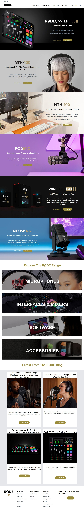

# This is a Rode-Clone Page

## Deployed Link

[Project Link](https://main--phani-sai-rode-clone.netlify.app/)

## Preview:

## Built with:

- TailWind CSS

## Key learnings:

- Learned to handle CSS Classes making responsive view using Tailwind CSS Media Querys and desktop view in HTML File without separate CSS file. 

## Time taken:

- I have taken 12hrs to build from scratch working atleast 2hrs per day for a 6days and I took more time for making it reponsive.
